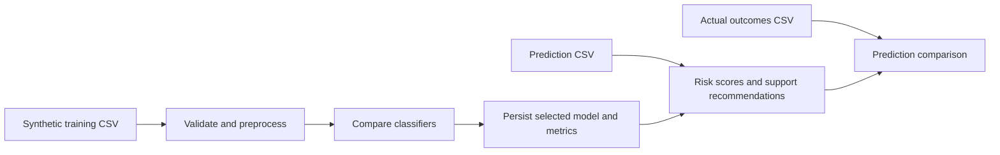

# EduPulse Platform

Flask-based student early-warning prototype for training academic-risk classifiers, reviewing predictions, and comparing predictions with later outcomes.

Live demo: https://edupulse-platform.onrender.com/

## What It Implements

- CSV validation and upload flows for training, prediction, and actual-result datasets
- Reproducible comparison of Logistic Regression, Decision Tree, Random Forest, and SVM classifiers
- Persisted best-model artifact and evaluation metrics
- Student-level risk bands and deterministic support recommendations
- Prediction-versus-actual comparison
- Render deployment blueprint, tests, and GitHub Actions CI

## Evidence Boundary

The included data is synthetic demonstration data. Model metrics show the behavior of this controlled prototype and should not be interpreted as evidence of effectiveness in a real educational setting.

Model metrics shown in the application are still produced from synthetic data.

Recommendations are deterministic rules based on input indicators and model risk. The application does not autonomously contact students, change academic records, or replace qualified human review.

## Architecture



## Security Controls

- Flask secret is supplied through `FLASK_SECRET_KEY` in deployment
- Uploads are restricted to CSV filenames and a 5 MB request limit
- The repository excludes local virtual environments and secrets
- Every page requires login except the login page, invite links and `/healthz`; there is no public sign-up
- Passwords are hashed with Argon2id; sessions are stored server-side and the session id is rotated at login
- Roles: viewers read results, explanations and comparisons; staff also upload datasets and export results; owners also train models
- CSRF protection on every form; session cookies are Secure, HttpOnly and SameSite=Lax
- Datasets and models are stored per organisation, and every query and storage read is scoped to the requesting organisation

EduPulse now requires authentication and isolates data per organisation. It is not yet approved for production student data: encryption at rest, data retention policy, breach procedure and a signed Data Processing Agreement are not implemented. Use synthetic or fully anonymised data only.

## Run Locally

```bash
python -m venv .venv
python -m pip install -r requirements.txt
export FLASK_ENV=development
flask --app wsgi db upgrade
flask --app wsgi create-org "Demo College" owner@example.com
python app.py
```

`create-org` prints a one-time invite link. Open it to set the owner's password, then log in. Add more users with `flask --app wsgi create-user demo-college tutor@example.com --role staff`.

`FLASK_ENV=development` uses a local SQLite database, a generated secret key and file storage under `var/storage/`. Any other value, including leaving it unset, is treated as production: the app refuses to start unless `FLASK_SECRET_KEY`, `DATABASE_URL`, `STORAGE_BACKEND=s3`, `STORAGE_ENDPOINT`, `STORAGE_BUCKET`, `STORAGE_ACCESS_KEY` and `STORAGE_SECRET_KEY` are set.

## Verify

```bash
python -m pip install -r requirements-dev.txt
python -m pytest -q
python -m compileall app.py config.py wsgi.py auth db migrations utils tests
```
